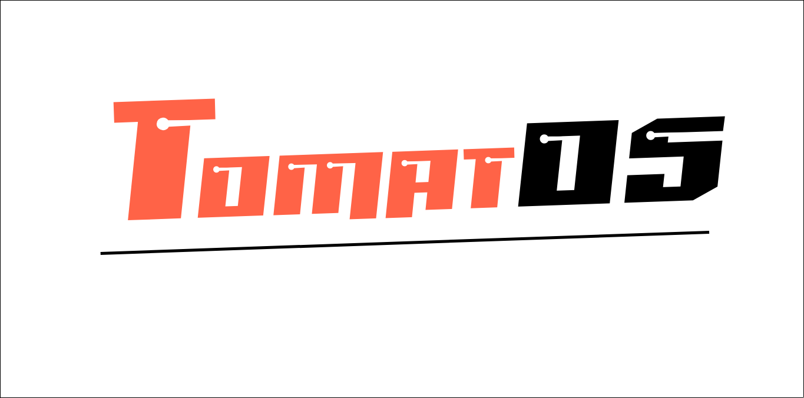
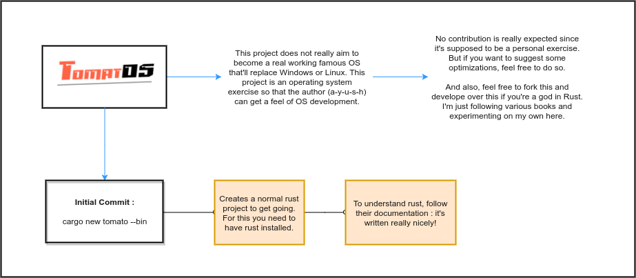

<h3 align="center">Tomatos</h3>

An operating system that I'm making as an attempt to understand OS development.

Bonus : contains cartoon-ish notes on step by step making of <b>Tomatos</b> as well :P 

***

<h3 align="center">Getting Started</h3>

